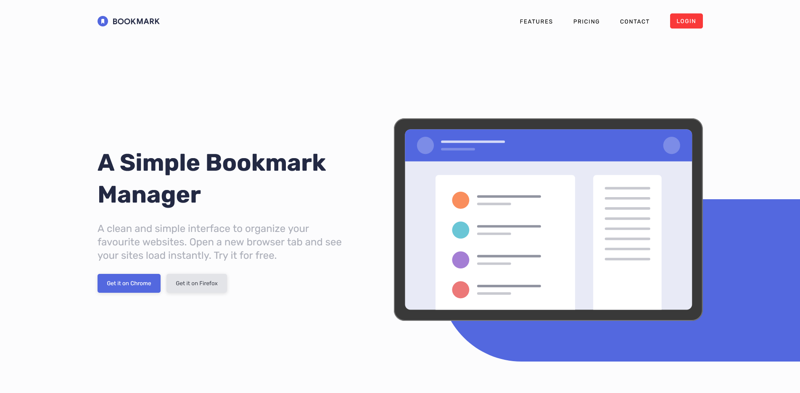

# Frontend Mentor - Bookmark landing page solution

This is a solution to the [Bookmark landing page challenge on Frontend Mentor](https://www.frontendmentor.io/challenges/bookmark-landing-page-5d0b588a9edda32581d29158). Frontend Mentor challenges help you improve your coding skills by building realistic projects.

### Links

- [Solution URL](https://www.frontendmentor.io/solutions/bookmark-landing-page-scss-accessible-tabs-and-accordion-javascript-PA5Ur2lcMi)
- [Live Site URL](https://hassaneljebyly.github.io/Bookmark-landing-page/public/)

### Built with

## Author

- Frontend Mentor - [@hassaneljebyly](https://www.frontendmentor.io/profile/hassaneljebyly)
- Twitter - [@HassanElJebyly](https://twitter.com/hassaneljebyly)
